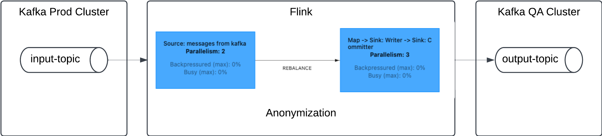

## Replication and Anonymization with Flink

In many cases anonymized data needs to be replicated from a production environment to a test or QA environment such that
integration tests can be run on the anonymized data. 

This project demonstrates how to use Flink to replicate anonymized data for this purpose, as depicted in the following overview diagram:

### Prerequisites
* Java 11 or newer
* Maven
* Docker
* `confluent` cli installed
* A Kubernetes Cluster
* A container registry 
* Linux or Mac Environment
* Confluent Operator 
* Confluent Flink Operator 

### Running this demo

1. compile the project with `mvn clean package`. Be sure to adjust the `bootstrap.servers` property in the `src/main/resources/replicate.properties` file to point to your Kafka cluster.
2. Copy the Flink jar file to the docker directory: `cp ../target/flink-replication-anonymization-1.0-SNAPSHOT.jar docker/`
3. build a docker image using the Dockerfile in the `deployment` directory and upload it to your container registry. 
4. If you are on GCP, you can use the `submit-build.sh` script to build the image and push it to the GCP container registry
5. Deploy a Kafka Cluster with Confluent for Kubernetes. There is a `confluent-platorm.yaml` file for this purpose
   in the `deployment` directory. Note that currently this demo only supports unauthenticated access to the Kafka cluster.
6. Spin up the Flink Kubernetes Operator. 
7. Spin up Confluent Manager for Apache Flink.
8. Port forward the Confluent Manager for Apache Flink to your local machine: `./cmf-port-forward.sh`
8. Create a Flink environment. You can use the `./create-flink-env.sh` script for this purpose.
9. Deploy the Flink application by running the script `./create-application.sh`. 
10. Port forward the Flink Job Manager Web UI: `./web-ui-port-forward.sh`
   